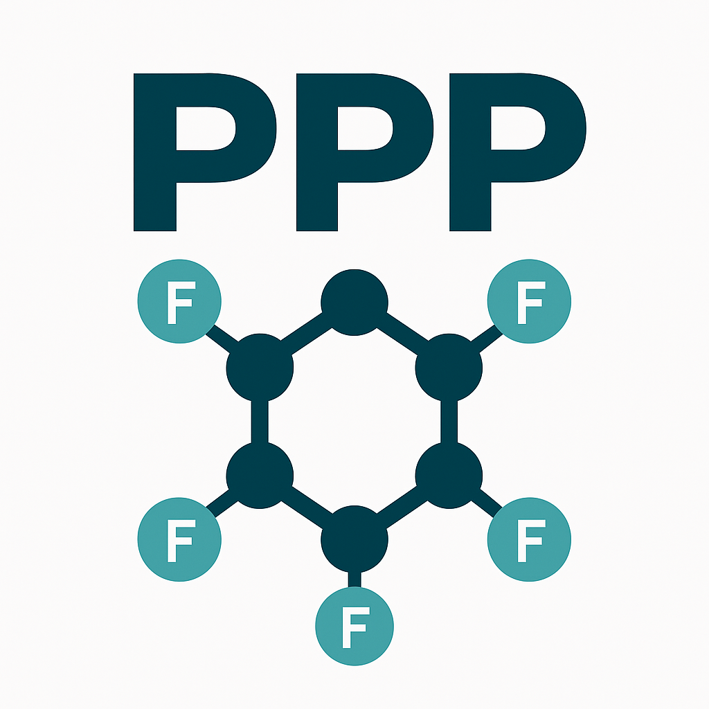

# PPP - Polymers' Properties Prediction

PPP - Polymers' Properties Prediction is a web application that allows user to upload SMILES for monomers of polymers or images of monomers to get some prediction about some properties of the polymers:

- Glass Transition Temperature (Tg) measured in degree Celsius °C.
- Fractional Free Volume (FFV)
- Thermal Conductivity (Tc) measured in W/m·K
- Density measured in g/cm^3^
- Radius of Gyration measured in Å.

__Note__: The app's predictions should only be treated as suggestions. Sometimes, it will recognize some non-polymer molecules as polymers, and it will still produce some predictions (which could be true, but probably not).

---

Usage: For those who's interested in the code, to run this project one must:

- One must use conda environment to run this server (for the usage of RDKit). Please see the `requirements.py` and also the YAML file `chem_env.yaml` for more info.
- To run the program, one must first download Docker then run `docker run -d -p 6379:6379 redis` to create the container for redis.
- Then in 1 terminal type `python run.py`, assuming you're in the project folder. In another terminal, type `celery -A celery_worker.celery worker -l info` to initiate celery workers.
- Now, everything is running. Congratulations!

---

For deploying with `gunicorn` and `docker`,

Use the `Dockerfile` and the `docker-compose.yml` for deploying the app.
