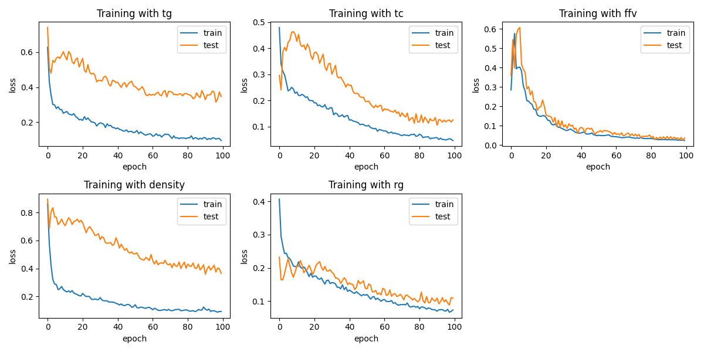
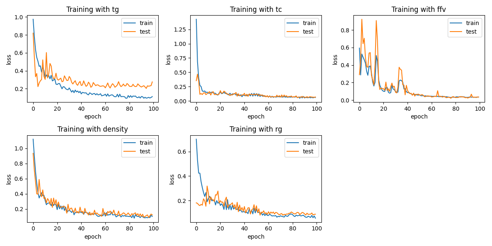
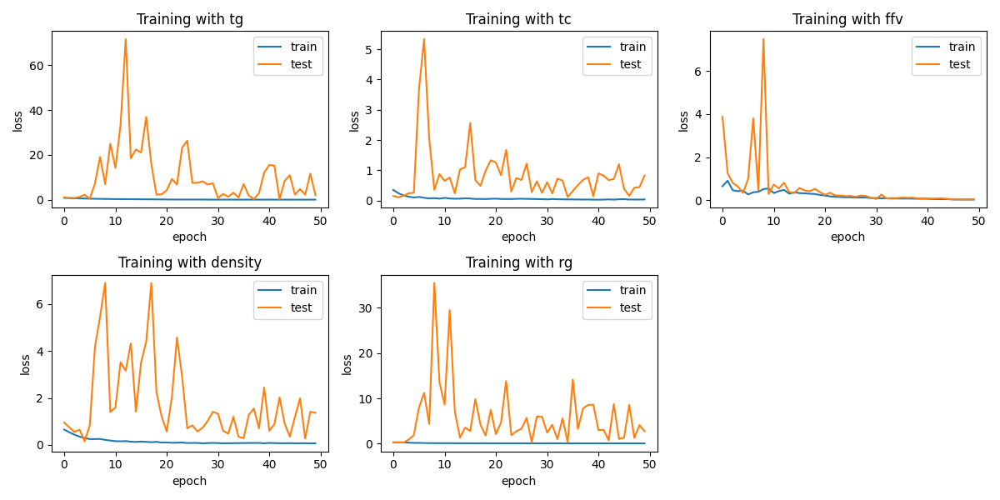

# Polymer Properties prediction

## 1. Structure of the project

I decomposed this project into 4 major components:

- `/data`, which stores the data for training and testing:

  - `train.csv`, which is the training (and validating) dataset.
  - `test.csv`, which is the test dataset used for submitting.
  - `submission.csv`, which is the submission.

- `/images`, which stores the training history (plots) when training:

  - `CNN.png`, which is the training history of a ResNet-inspired CNN.
  - `RNN.png`, which is the training history of an RNN.
  - `MLP.png`, which is the training history of an MLP.

- `/model`, which stores the models, training, and dataset objects/functions:

  - `data.py`, which is the dataset object that stores the training data.
  - `functional.py`, which is a helper module for building the ResNet-inspired CNN.
  - `models.py`, which contains 3 different models used for this ML task: CNN, RNN, and MLP
  - `training.py`, which contains functions for batch GD and configuring.

- `/utils`, which stores modules that help with visualizing, vectorizing SMILES, and custom loss function:

  - `loss.py`, which stores custom loss classes/functions.
  - `vectorize.py`, which contains function for vectorizing SMILES-represented polymers.
  - `visualize.py`, which contains functions for visualizing the training history of the models.

- `/notebooks`, which contains the training notebook and a notebook I used for exploring the data.

  - `data_explore.ipynb`, for exploring the data.
  - `poly_properties.ipynb`, for training the models.
  - `cnn-resnext-inspired.ipynb`, just the notebook version for Kaggle.

- `/requirements.txt`
- `/pretrained` which stores the models I have trained.

## 2. A Note about design choice

By exploring the dataset, we can see that there are entries that don't have all the properties. Because of this, I decide to create 5 different models for 5 different properties. Each property has 3 models: CNN, RNN, and MLP. I utilize GPU to boost the training time.

A small note is that I use `rdkit`'s `MorganGenerator` to generate Morgan Fingerprint to represent different molecules given their SMILES representation.

## 3. Models

### 3.1 CNN

---

The CNN model I use utilize the ResNet (or rather ResNeXT) block (see [functional](./model/functional.py)). It first passes the embedded data from `rdkit` with 1 channel through a stem layer, which is a simple 1D convolution to shrink the data size. Next, the data is passed through 2 ResNet block, one keeping the dimensions and one down sampling layer.
Lastly, the data is passed through a head which is a simple `Linear` layer.

Since most properties have a relatively "small" dataset (except FFV), I don't have a deep neural network per se. Also, since I train 5 different models, it will take up quite a lot of spaces in the memory. Therefore, I opt for a batch gradient descent. Here are the hyperparameters I choose for the CNN models:

<!--
tg_cnn = PolymerCNN(1, (32, 32, 64, 64, 128, 256), ((4, 8), (2, 4, 8, 8)), 2, (2, 4), 256)
ffv_cnn = PolymerCNN(1, (32, 64, 64, 128, 128, 256), ((4, 8), (8, 16, 16, 32)), 2, (2, 4), 512)
tc_cnn = PolymerCNN(1, (16, 32, 32, 64, 128, 256), ((4, 8), (2, 4, 8, 8)), 2, (2, 4), 256)
density_cnn = PolymerCNN(1, (32, 32, 64, 64, 128, 256), ((4, 8), (2, 4, 8, 8)), 2, (2, 4), 256)
rg_cnn = PolymerCNN(1, (16, 32, 32, 64, 128, 256), ((4, 8), (2, 4, 8, 8)), 2, (2, 4), 256) -->

- For Tg and Density:
  - `output size`: $1$
  - `channels`: $(32, 32, 64, 64, 128, 256)$
  - `groups`: $((4, 8), (2, 4, 8, 8))$
  - `depth`: $2$
  - `block_depths`: $(2, 4)$
  - `hidden_size`: $256$

- For Tc and Rg:
  - `output size`: $1$
  - `channels`: $(16, 32, 32, 64, 128, 256)$
  - `groups`: $((4, 8), (2, 4, 8, 8))$
  - `depth`: $2$
  - `block_depths`: $(2, 4)$
  - `hidden_size`: $256$

- For the FFV property:
  - `output size`: $1$
  - `channels`: $(32, 64, 64, 128, 128, 256)$
  - `groups`: $((4, 8), (8, 16, 16, 32))$
  - `depth`: $2$
  - `block_depths`: $(2, 4)$
  - `hidden_size`: $512$

__NOTE 1__ : Please note that the number of channels __must__ be divisible by 3. This is because each 3 numbers in `channels` are the channels used in the ResNet block.

__NOTE 2__: Also, note that the `groups` are the number of groups in the ResNet block. The length of each group in `groups` must match the numbers in `block_depths`. Lastly, the number of numbers in `blocks_depth` __must__ match the `depth`.

### 3.2 RNN

---

The RNN model I have is similar to the CNN one, except I simply pass in the data directly into the RNN. Then, I pass the output into a simple `Linear` layer.

Here are the hyperparameters I used for the RNN models:

- For any properties except FFV:
  - `input dimension`: $1$
  - `output size`: $1$
  - `number of layers`: $3$
  - `hidden_size`: $16$
  - `hidden_sizes` for `Linear` layers: $(128, 64)$

- For FFV:
  - `input dimension`: $1$
  - `output size`: $1$
  - `number of layers`: $3$
  - `hidden_size`: $16$
  - `hidden_sizes` for `Linear` layers: $(256, 512)$

### 3.3 MLP

I consider this model a "baseline" to compare with the other two models. This is just a simply multilayer perceptrons. The parameters I used are:

- For any properties except FFV: `hidden_sizes`: $(256, 128)$
- For FFV: `hidden_sizes`: $(1024, 512, 256)$

__NOTE__: I also add `Dropout` layers with `p=0.5` into the MLP to avoid overfitting.

### Training

For training, I use batch gradient decent since I couldn't load the entire dataset onto Google Colab without the error about memory. I use the `Adam` optimizer with a learning rate of $0.0001$.

For the loss function, I create a custom loss function for the `MAD` or Mean Absolute Deviation. I also provided a class for weighted `MAD` for other experiment.

I train all models with a GPU T4 and the training takes about $1000$ seconds for the CNN models, about a few hundreds

## 4. Result

The "baseline" MLP. In general, the MLP performed well for Tc, Rg, and FFV: . For the density and the Tg property, the model performed not too well on the validation set.

Overall, the CNN models performed well for all properties. Here are the training history for the CNN models: 

For the RNN models, we can see that the training didn't converge well for Rg. For other models, it seems that the model did converge for FFV, Tc, and density. Nevertheless, this divegence might be attributed to a large learning rate: 

For all properties except FFV, I picked the CNN models for generating my best performing model. For the FFV, I use the MLP model.

The weighted MAD metric created by the competition for the training dataset is $0.0367$.
